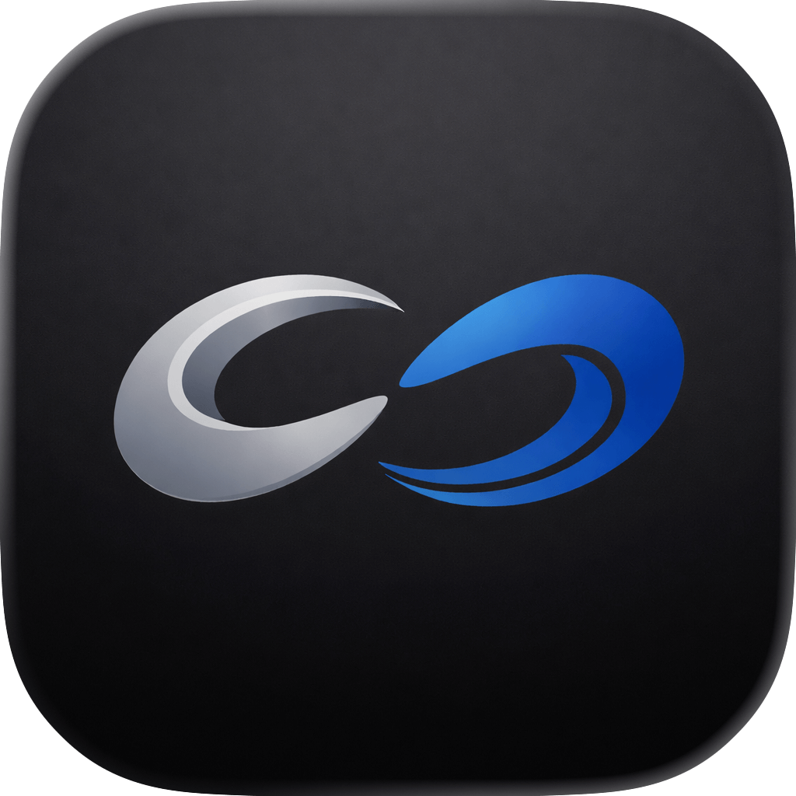
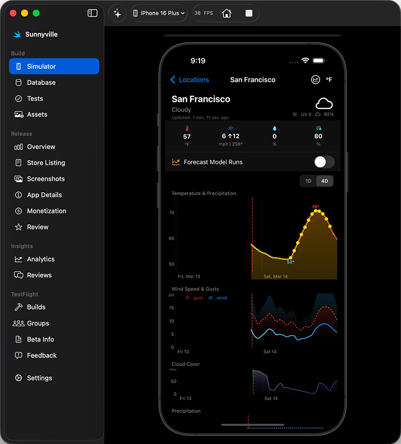
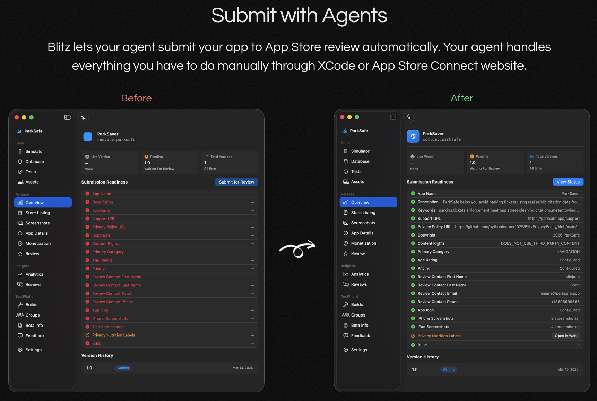

<div align="center">
  
  <h1>Blitz</h1>
  <p>Native macOS app for building, testing, and shipping iOS apps with AI agents</p>

  [](https://blitz.dev/)
  [](https://discord.gg/wJQ6dA95S6)
  [](LICENSE)
</div>

<br />

<div align="center">
  
</div>

<br />

Blitz is a native macOS app that gives AI agents full control over the iOS development lifecycle — simulator/iPhone management, database setup, and App Store Connect submission. It includes built-in MCP servers so Claude Code (or any MCP client) can build, test, and submit your app to the App Store.

<div align="center">
  
</div>

## Requirements

- macOS 14+ (Sonoma)
- Xcode 16+ (Swift 5.10+)
- Node.js 18+ (for build scripts and sidecar)

## Build from source

```bash
# Clone
git clone https://github.com/blitzdotdev/blitz-macos.git
cd blitz-macos

# Debug build
swift build

# Release build
swift build -c release

# Bundle as .app (ad-hoc signed)
bash scripts/bundle.sh release

# The app is at .build/Blitz.app
open .build/Blitz.app
```

For signed builds, copy `.env.example` to `.env` and fill in your Apple Developer credentials, then run:

```bash
bash scripts/bundle.sh release
```

## Verify a release binary

Every GitHub release includes `SHA256SUMS.txt` with checksums of the CI-built binary. To verify:

**Option 1: Check a downloaded binary against release checksums**
```bash
# Download both Blitz.app.zip and SHA256SUMS.txt from the GitHub release
shasum -a 256 -c SHA256SUMS.txt
```

**Option 2: Build from source and compare**
```bash
bash scripts/verify-build.sh v1.0.20
```

This builds the app locally and compares the main executable checksum against the release. CI builds use ad-hoc signing, so checksums match when you build with the same toolchain.

**Option 3: Inspect the CI build yourself**

All release binaries are built by the public [GitHub Actions workflow](.github/workflows/build.yml). The workflow is transparent — you can audit every step and verify that the published artifact matches what the workflow produced.

## Security and privacy

- **No analytics or telemetry.** The app makes zero tracking calls. No data is collected about your usage.
- **No phone-home.** The only network requests are to Apple's App Store Connect API (when you use ASC features) and GitHub's releases API for optional update checks.
- **MCP server is localhost-only.** The built-in MCP server binds to `127.0.0.1` and is never exposed to the network.
- **No access to sensitive data.** The app does not access your contacts, photos, location, or any personal data. Screen capture is limited to the iOS Simulator window.

## Architecture

Single-target SwiftUI app built with Swift Package Manager. All source lives in `src/`. See [CLAUDE.md](CLAUDE.md) for detailed architecture documentation.

## License

[Apache License 2.0](LICENSE)
